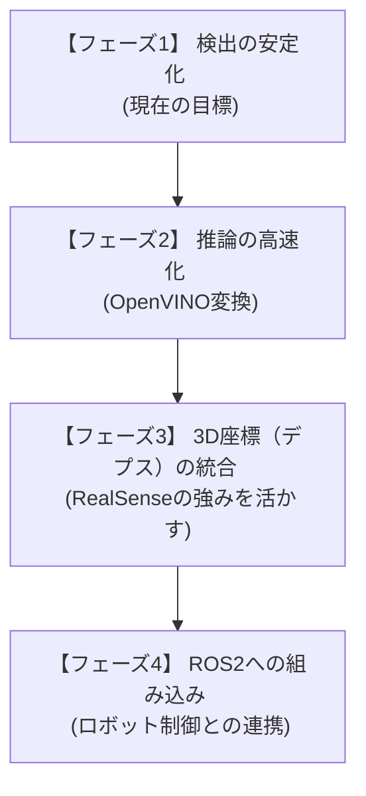

# ロボコン向け YOLO アノテーション & 高速化ガイド

このガイドでは、作成した環境を使ってこれからどのように学習データを準備し、Mini PC (Minisforum TH50) 上で高速に動作させるかを説明します。

## 1. データセットの準備とアノテーション

今回は特定の色のバレーボールと中深皿を検出します。まずはこれらの画像を集める必要があります。

### ステップ 1: 画像の収集

実際の競技環境（照明条件や背景が本番に近い場所）で、バレーボールと中深皿の写真を様々な角度や距離から撮影します。

`predict_realsense.py` を起動して撮影を行います。用途に合わせて以下のキーを使い分けてください：
- **`s` キー**: 画像(`.jpg`)のみを保存します（最初の30〜50枚を集める時におすすめ）。
- **`a` キー**: 画像(`.jpg`)と同時に、AIが予測した枠のテキストファイル(`.txt`)をセットで保存します（オートアノテーション）。

> **💡 効率的な進め方（超おすすめ！）**
> いきなり100〜200枚すべてを手作業でアノテーションするのは大変です。**まずは30〜50枚程度だけ集めてアノテーションし、一度AIを学習（`train.py`）させてみましょう。**
> そこで出来たモデル（`best.pt`）を読み込ませてから残りの撮影を行うと、組み込まれた「オートアノテーション機能」が働き、残りのテキストファイルには**最初から自動で正解の枠が書き込まれた状態**になります！あとは間違いを手直しするだけで済むため、作業時間が劇的に短縮されます。最終的に1クラス100〜200枚程度を目指してデータを増やしていくのがベストです。

---
### 📸 質の高いデータを作るための心構え（超重要）

最強のAIを作るためには「ただ数が多い」ことよりも「質とバリエーション」が重要です。以下のポイントを意識して撮影してください。

#### 1. 高さは「ロボット目線」が基本
カメラの高さは、**ロボットに実際に搭載する高さと角度**に合わせるのが大原則です（全体の7〜8割）。人間が立ったまま見下ろして撮った写真は、ロボットにとっては役に立ちません。

#### 2. わざと「ブレ・傾き」を混ぜる
本番中は急発進や段差でロボットが揺れたり傾いたりします。そのため、基本の高さから少しだけ高く/低くしたり、**わざとカメラを斜めに傾けた写真（残りの2〜3割）**を混ぜておくことで、少々の揺れでは見失わないタフなAIになります。

#### 3. 「意地悪なシチュエーション」をあえて撮る（オクルージョン）
ボールの手前に細い柱があったり、ネット越しだったり、他のロボットに一部が隠れていたりする画像を必ず含めてください。
**※アノテーション時の注意**: 柱で半分隠れているような場合でも、「左半分と右半分」のように2つの枠に分けるのではなく、**柱を無視して「ボール全体がそこにあるもの」として大きな1つの枠で囲んでください。** これによりAIは「隠れていてもこれは1つのボールだ」と賢く学習します。

#### 4. クラスごとの枚数バランスを揃える
ピンクのボールを1000枚、水色のボールを50枚といった極端な偏りはNGです。AIが「とりあえずピンクと答えておけば当たる」とズルをするようになります。各クラスの枚数はできるだけ同じくらい（せめて2:1以内）に揃えましょう。
---

### ステップ 2: 通常プロジェクトでのアノテーション（ラベル付け）と確定

通常の「Object Detection (Bounding Box)」プロジェクトでは、以下の手順でアノテーションを行います。

#### 1. 画像のアップロードと割り当て
- 画像をドラッグ＆ドロップで追加したら、画面右上の **「Finish Uploading」**（アップロード完了）をクリックします。
- 「誰にアノテーションを割り当てるか」を聞かれるので、**「Assign to Myself」**（自分に割り当てる）を選択して確定します。

#### 2. アノテーション（枠囲み）作業
- 左側メニューの **「Annotate」**（鉛筆マーク）をクリックします。
- 「Unstarted」または「Annotating」に入っている画像をクリックすると、黒い背景の編集エディタが開きます。
- **枠を描く**: マウスでドラッグして対象物（ボールや皿）を囲みます。（※キーボードの **`B` キー** を押すと四角形ツールになります）
- **クラス名をつける**: 枠を描くと入力ポップアップが出るので、以下の正式なクラス名を入力（または選択）します。
  - `volleyball_pink` (ピンクのボール)
  - `volleyball_cyan` (水色のボール)
  - `plate` (中深皿)
- **次の画像へ**: キーボードの **「右矢印（→）」** キーまたは画面右上の **「➔」** ボタンを押して、全ての画像のアノテーションを完了させます。

#### 3. データセットに追加する
- 全ての画像のアノテーションが終わったら、左上の **「←（戻る）」** ボタンで画像一覧に戻ります。
- 画面右上にある **「Add [枚数] images to Dataset」**（データを確定して追加）ボタンをクリックします。

### ステップ 3: YOLOv8形式での書き出しと配置

アノテーションされた画像データを「YOLOv8」形式でダウンロードします。

1. **データセットの作成 (Generate)**
   - 通常画面の左側メニューから **「Generate」**（波線のようなアイコン）をクリックします。
   - **「Generate New Version」** をクリックします。
   - 前処理（Preprocessing）や拡張（Augmentation）の設定が出ますが、最初は何も変更せずに **「Continue」** や **「Generate」** を押し進め、データセットのバージョン（Version 1）を作成します。
2. **YOLOv8形式でエクスポート (Export)**
   - 生成されたバージョンの画面上部にある **「Export Dataset」** ボタンをクリックします。
   - フォーマット（Format）に **「YOLOv8」** を選択します。
   - ダウンロード方法として **「download zip to computer」** を選択して、ZIPファイルをダウンロードします。
3. **ローカルフォルダへの配置**
   - ダウンロードしたZIPファイルを解凍します。
   - 解凍したフォルダ（`train`, `valid`, `test` ディレクトリや `data.yaml` が入っています）を、このプロジェクトディレクトリ内の `yolo_assets/datasets/robocon_data/` に配置します。
     - 配置後の構造例：
       ```text
       yolo_test/
         yolo_assets/datasets/
           robocon_data/
             train/
               images/
               labels/
             valid/
               images/
               labels/
             data.yaml  (※Roboflowが生成した設定ファイル。後で確認します)
       ```

## 2. Minisforum TH50 (Intel CPU) での推論の高速化

TH50には強力なNVIDIAのGPUが搭載されていませんが、Intelの **OpenVINO** という技術を使うことで、CPUや内蔵グラフィックス（Iris Xe）を使ってYOLOを劇的に高速化できます。

### ステップ 1: モデルの変換（初回のみ）

`yolo_detector.py` に、OpenVINO形式へ変換するための関数を用意しています。
学習が終わって `best.pt` というモデルができたら、一度だけ `convert_openvino.py` を実行してモデルを変換します。


### ステップ 2: 変換したモデルで実行

エクスポートが完了すると、同じフォルダに `best_openvino_model` というディレクトリが作成されます。
推論スクリプト (`predict_realsense.py`) のモデル読み込み部分を、このディレクトリパスに変更します。

```python
# 変更前
detector = YoloDetector(model_path='yolo_assets/robocon_models/custom_model_v1/weights/best.pt')

# 変更後 (OpenVINOモデルを指定)
detector = YoloDetector(model_path='yolo_assets/robocon_models/custom_model_v1/weights/best_openvino_model/')
```

これで、Intel CPUに最適化された高速な推論が行われるようになります。

## 3. 学習データの追加とクラスの追加手順

データの追加や新しいオブジェクトの登録を行う場合は、状況に応じて以下の手順を行います。

### パターンA：既存クラスの画像数を増やして精度を上げたい場合（推奨）

すでに学習済みの `best.pt` を使ってオートアノテーション（自動枠付け）を行い、効率よくデータを増やします。

1. **推論スクリプトのモデルを書き換える**
   [predict_realsense.py](file:///home/hatsu/Robobobo/yolo_tourobo/predict_realsense.py) を開き、初期化時の `model_path` を学習済みモデルに変更します。
   ```python
   # 変更前
   detector = YoloDetector(model_path='yolo11n.pt', conf_threshold=0.5)

   # 変更後（学習したモデルを指定）
   detector = YoloDetector(model_path='yolo_assets/robocon_models/custom_model_v1/weights/best.pt', conf_threshold=0.5)
   ```
2. **`a` キーでオートアノテーション撮影を行う**
   撮影用スクリプトを動かし、追加したいシーンを **`a` キー** で撮影します。これで画像とアノテーションファイル（`.txt`）がセットで保存されます。
3. **Roboflowへの追加と手直し**
   保存された画像と `.txt` ファイルをまとめて Roboflow にアップロードすると、自動でアノテーションが読み込まれます。必要に応じて位置のズレのみを手動で修正します。
4. **再学習とOpenVINO変換**
   Roboflow で新しいバージョンを生成（Generate）してダウンロードし、`yolo_assets/datasets/robocon_data` に上書き配置した後、[train.py](file:///home/hatsu/Robobobo/yolo_tourobo/train.py) を実行して再学習し、[convert_openvino.py](file:///home/hatsu/Robobobo/yolo_tourobo/convert_openvino.py) を実行してモデルを更新します。

---

### パターンB：新しい別の物体（新しいクラス）を追加したい場合

1. **Roboflowでのクラス追加**
   Roboflow のアノテーション画面やプロジェクト設定から、新しく検出したい物体のクラス名（例: `robot_hand` など）を追加します。
2. **`s` キーでの撮影と手動アノテーション**
   新しく追加する物体は今のAIでは検出できないため、撮影スクリプトで **`s` キー** を使い、生の画像（`.jpg`）として保存します。アップロード後、Roboflow 上で手動で枠囲みとクラス割り当てを行います。
3. **設定ファイル（`dataset.yaml`）の更新**
   新しいバージョンをダウンロードして配置すると、クラス数が増えます。
   それに合わせてローカルの [dataset.yaml](file:///home/hatsu/Robobobo/yolo_tourobo/dataset.yaml) の `nc`（クラス数）と `names`（クラス名リスト）を手動で更新します。
   * **例：4つ目のクラス `target_box` を追加する場合**
     ```yaml
     nc: 4
     names:
       0: volleyball_cyan
       1: volleyball_pink
       2: plate
       3: target_box  # 新規追加
     ```
4. **再学習とOpenVINO変換**
   [train.py](file:///home/hatsu/Robobobo/yolo_tourobo/train.py) ➔ [convert_openvino.py](file:///home/hatsu/Robobobo/yolo_tourobo/convert_openvino.py) の順に実行して、新しいクラスに対応したモデルを作成します。

---

## 4. ROS2への組み込みについて

`predict_realsense.py` 内に `detections` というリストを取得している部分があります。
ROS2のノードを作る際は、この推論部分（`yolo_detector.py`）をROS2の `Node` クラスの中で呼び出し、取得した `detections` の座標データ（バウンディングボックスの中心など）をパブリッシュする仕組みにすることで、ロボットの制御側で簡単に物体位置を受け取ることができます。

---

## 5. 開発ロードマップと今後のステップ

YOLOを用いた物体検出システムを実際のロボコンで運用するまでの全体ロードマップです。



### 📍 各フェーズの詳細とやることリスト

#### 【フェーズ1】 検出の安定化（現在の目標）
* **目標**: [predict_realsense.py](file:///home/hatsu/Robobobo/yolo_tourobo/predict_realsense.py) で対象の物体（バレーボールや中深皿）をカメラに映した際、ブレや誤検出なく、バウンディングボックス（四角）が安定して描画されること。
* **やること**:
  * [ ] [predict_realsense.py](file:///home/hatsu/Robobobo/yolo_tourobo/predict_realsense.py) の `a` キーで多様なアングル・背景の画像を収集する（30〜50枚からスタートし、最終的に1クラス100〜200枚を目指す）。
  * [ ] Roboflowなどのアノテーションツールを用いてデータをアノテーションし、YOLOv8形式でダウンロードする。
  * [ ] [train.py](file:///home/hatsu/Robobobo/yolo_tourobo/train.py) で学習を実行し、高精度な `best.pt` を作成する。

#### 【フェーズ2】 推論の高速化（OpenVINO変換）
* **目標**: ロボット搭載PC（Minisforum TH50などのIntel CPU環境）で、遅延（カクつき）なくリアルタイムで物体検出が動作すること。
* **やること**:
  * [ ] [convert_openvino.py](file:///home/hatsu/Robobobo/yolo_tourobo/convert_openvino.py) を実行して、学習した `best.pt` を OpenVINO 形式にエクスポートする。
  * [ ] `predict_realsense.py` 内で読み込むモデルパスを `best_openvino_model/` ディレクトリに変更し、動作速度（FPS）が向上することを確認する。

#### 【フェーズ3】 3D座標（デプス）の統合
* **目標**: 検出した物体の「画面上のピクセル位置」だけでなく、「ロボット（カメラ）から見て、前方Xミリ、左右Yミリ、高さZミリ」という3次元空間上の位置を特定すること。
* **やること**:
  * [ ] RealSenseのデプスストリーム（`rs.stream.depth`）を有効化し、カラー画像とデプス画像を位置合わせ（`rs.align`）する。
  * [ ] YOLOで検出したバウンディングボックスの中心座標を取得し、そのピクセルのデプス値（距離）を取得する。
  * [ ] 取得したピクセル座標と距離を、RealSenseの内部パラメータ（イントリンジック）を用いて3Dのカメラ座標系 `(X, Y, Z)` に変換する。

#### 【フェーズ4】 ROS2への組み込み（ロボット制御との連携）
* **目標**: 検出した物体の3D座標をロボットの移動制御やマニピュレータ（アーム）制御プログラムに送信し、自動で回収・アプローチさせること。
* **やること**:
  * [x] `yolo_node.py` として画面を持たないROS2ノードを作成・パッケージ化する（完了）。
  * [x] 検出結果（クラス名、3D座標、信頼度など）をJSON形式の文字列（`std_msgs/String`）としてパブリッシュする仕組みを実装する（完了）。
  * [ ] 制御側ノードでそのトピックをサブスクライブ（受信）し、物体に向かって自律移動する制御ロジックを実装する。

---

## 6. 【発展】Roboflowを使わない完全ローカル自動再学習（Auto-Retraining）

Roboflowを使わずに、現場（オフライン環境）で撮影したデータをそのまま自動でデータセットに結合し、モデルの強化（学習）までをワンストップで行う「アクティブラーニング」の手法です。

### 🚀 メリット
- **圧倒的な時短**: 画像のアップロード・ダウンロードの手間がなく、コマンド一発で賢くなります。
- **完全オフライン**: ネット環境がない大会会場でも、照明や環境に合わせて即座にモデルを最適化できます。

### ⚠️ 重大なデメリット・注意点（AIがバカになるリスク）
この自動化には**「間違った学習データの増幅」**という非常に危険なリスクがあります。
`predict_realsense.py` 中に `a` キーを押すと、現在のAIの認識枠がそのまま「正解」として保存されます。もしAIが別の物体を誤認識している時に `a` キーを押してしまうと、その**「間違った認識」を正解として再学習してしまい、誤検知がさらに増える負のループ**に陥ります。

### 💡 安全に運用するための絶対ルール
この自動再学習ツールを使う場合は、以下の運用ルールを必ず守ってください。
> **「AIの認識枠（バウンディングボックス）が対象物に100%完璧に合っている瞬間だけ `a` キーを押す」**
> 少しでもズレている時や、誤検知している時は絶対に `a` キーを押さないこと。（もし間違えて押した場合は、手動でフォルダからその画像を削除してください）

### 🔧 実行フロー（スクリプト実装例）

もしこのアプローチを採用する場合、以下のような動作をする統合スクリプト（例：`auto_model_learn.py`）を作成します。

1. **データの統合**
   `yolo_assets/collected_images/` 内にある `annotated` の画像と `.txt` ファイルを自動でスキャンし、YOLOの学習データセット（`yolo_assets/datasets/robocon_data/`）へコピーして統合する。
2. **学習の実行**
   裏で自動的に `train.py` と同じ学習プロセス（`YOLO(model).train(...)`）を起動する。
3. **OpenVINO変換**
   学習完了後、新しくできた `best.pt` を読み込んで自動的に `export(format='openvino')` を実行する。
4. **クリーンアップ**
   学習に使い終わった `annotated` フォルダ内の画像を「学習済みフォルダ（`trained_images`など）」に移動し、二重学習を防ぐ。

現場で「あ、少し認識が弱いな」と思ったら、**`predict_realsense.py`で完璧な瞬間だけを狙って数十枚 `a` キーで撮影し、`python auto_model_learn.py` を実行してコーヒーを飲んで待つだけ**で、環境に適応した最新モデルが完成するようになります。

